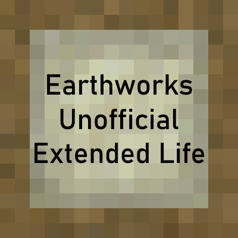

# Earthworks - Unofficial Extended Life

*A small variety of earthen based building blocks.*
• [CurseForge](https://curseforge.com/minecraft/mc-mods/earthworks-extended-life)
• [Changelog](CHANGELOG.md)
• [Bugtracker](https://github.com/Ender-Development/Earthworks-Extended-Life/issues)

 

Taking cues from the Stone Age, Bronze Age, and Iron Age, Earthworks adds some of the first materials mankind used to craft.  Materials like wattle and daub, wicker, rammed earth, and adobe bricks.  These are crude materials, fashioned out of what was at hand, and easily accessible, but prove to be as strong as stone when fashioned properly.  Utilizing these in an early build will provide some excellent shelters.

Since the original repo is unfortunately currently no longer maintained, we have decided to re-release the mod and continue supporting it for version 1.12.2 for the foreseeable future.

## Builds
You can download the latest files here on [curseforge](curseforge.com/minecraft/mc-mods/earthworks-extended-life).

## Changes

Current Changes to Earthworks v1.3.6:
* fixed [issue #43](https://github.com/Alsender/Earthworks/issues/43)
* merged [pull #42](https://github.com/Alsender/Earthworks/pull/42)
* added a config options for the binding materials

## [Ender-Development](https://github.com/Ender-Development)

Our Team currently includes:
- `_MasterEnderman_` - Project-Manager, Lead-Artist, Developer
- `Klebestreifen` - Lead-Developer, Artist

You can contact us on our [Discord](https://discord.gg/JF7x2vG).

## Credits
* [Link to the original curseforge page](https://legacy.curseforge.com/minecraft/mc-mods/earthworks)

### Original Author
* Alsender

### Code Helper
* Loraanicus
* Voila
* Gryphon
* FreneticScribbler

### Art Input
* Gryphon
* KillaJoke
* Loraanicus,
* Nezcal Spindrake
* Voila
